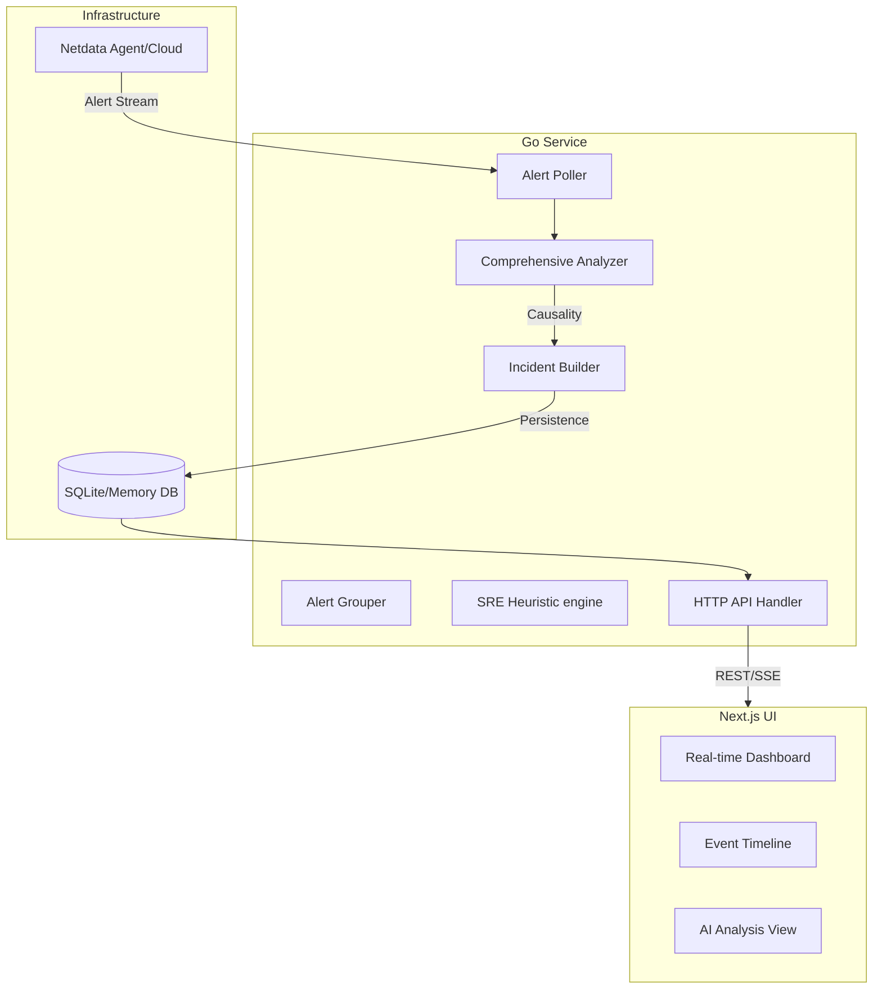

# IncidentTeller - AI-Powered SRE Incident Analysis Platform

**IncidentTeller** is a high-performance incident analysis platform designed for modern SRE teams. It autonomously transforms raw monitoring alerts from sources like Netdata into prioritized, actionable intelligence. By leveraging hexagonal architecture in Go and a modular Next.js frontend, it provides real-time correlation, root-cause prediction, and automated remediation guidance.

## 📋 Core Capabilities

IncidentTeller goes beyond basic alert grouping to provide a full SRE-grade analysis suite:

-   **Intelligent Alert Correlation**: Groups related alerts across hosts and resources using a time-windowed causality engine.
-   **SRE-Grade Analysis**: Uses a custom SRE heuristic engine to calculate confidence scores (0-100%) for root cause candidates.
-   **Causality Tracking**: Identifies exactly "what broke first" by analyzing the earliest anomalies in an incident timeline.
-   **Blast Radius Analysis**: Predicts the impact scope, cascade depth, and business risk of an incident.
-   **Actionable Remediation**: Generates technical playbooks (Suggested Fixes) specific to the identified resource exhaustion or service failure.
-   **Real-Time Visualization**: Provides live-updating dashboards and event timelines via Server-Sent Events (SSE).
-   **Health & Diagnostics**: Built-in self-monitoring for database status, Netdata connectivity, and internal resource usage.

## 🏗️ Technical Architecture

IncidentTeller follows **Clean Architecture (Hexagonal)** principles, ensuring business logic is decoupled from external infrastructures like databases and monitoring agents.



### Key Internal Components
-   **SREAnalyzer**: The brain of the system. It scores candidates based on arrival time, cascade probability, resource criticality, and log correlation.
-   **ComprehensiveAnalyzer**: Orchestrates the analysis flow, combining root cause, blast radius, and remediation into a unified `IncidentIntelligence` package.
-   **RealTimePoller**: Supports both local Netdata agents and Netdata Cloud for alert ingestion.

## 🚀 Quick Start

### Prerequisites
-   **Go 1.20+**
-   **Node.js 18+** & **npm**
-   **Netdata Agent** (running locally or accessible via URL)

### Backend Installation

```bash
# 1. Clone & Build
git clone https://github.com/your-org/IncidentTeller.git
cd IncidentTeller
make build

# 2. Configure
cp config.example.yaml config.yaml
# Edit config.yaml with your Netdata URL

# 3. Run
./bin/incident-teller
# Or run with in-memory DB for quick testing
make run-memory
```

### Frontend Installation

```bash
cd ui
npm install
npm run dev
# Dashboard available at http://localhost:3000
```

## 📁 Project Structure

```text
IncidentTeller/
├── cmd/
│   └── incident-teller/    # Application entry point
├── internal/
│   ├── adapters/           # Infrastructure (Netdata, SQLite, OpenAI)
│   ├── ai/                 # AI/ML interface definitions
│   ├── api/                # HTTP handlers & middleware
│   ├── domain/             # Core models (Alert, Incident, Timeline)
│   ├── services/           # Business Logic
│   │   ├── sre_analyzer.go       # Root cause scoring engine
│   │   ├── blast_radius.go        # Impact analysis
│   │   ├── incident_builder.go    # Correlation logic
│   │   └── poller.go              # Real-time ingestion
│   └── observability/      # Logging & Metrics
├── ui/                     # Next.js Frontend
│   └── src/app/            # Pages (Dashboard, Health, Analysis)
└── Makefile                # Build and dev automation
```

## 📈 API Reference

| Endpoint | Method | Description |
| :--- | :--- | :--- |
| `/api/incidents` | `GET` | Paginated list of incidents |
| `/api/incidents/{id}` | `GET` | Full incident details with AI analysis |
| `/api/incidents/summary`| `GET` | Dashboard stats & overall risk level |
| `/api/timeline/{id}` | `GET` | Standard chronological event list |
| `/api/timeline-enhanced/{id}` | `GET` | Timeline with cascade & causality metadata |
| `/api/analyze` | `POST` | Trigger manual re-analysis of current state |
| `/api/events` | `GET` | SSE stream for real-time incident updates |
| `/api/diagnostics` | `GET` | Detailed system component health status |
| `/api/logs` | `GET` | Recent internal service logs |
| `/api/metrics/export` | `GET` | Export service metrics in CSV format |

## 🔧 Configuration (config.yaml)

```yaml
server:
  port: 8080
  read_timeout: 10s

netdata:
  base_url: "http://localhost:19999"
  poll_interval: 10s
  cloud_enabled: false

ai:
  enabled: true
  model_type: "local"
  confidence_threshold: 0.7

database:
  type: "sqlite" # 'sqlite' or 'memory'
  sqlite_path: "./incident_teller.db"

observability:
  log_level: "info"
  enable_metrics: true
```

## 🔍 Monitoring & Debugging

### Health Check
Check the specialized diagnostic endpoint for component-level health:
```bash
curl http://localhost:8080/api/diagnostics | jq
```

### In-Memory Development
Run without a persistent database for rapid development:
```bash
make run-memory
```

### Generating Test Alerts
Use the hidden internal endpoint to trigger a simulated critical incident:
```bash
curl -X POST http://localhost:8080/api/test/create-incident
```

## 📞 Support & Community
-   View internal logs: `curl http://localhost:8080/api/logs`
-   Check Metrics: `curl http://localhost:8080/api/metrics/export`

---
**IncidentTeller** - Bridging the gap between raw monitoring data and actionable SRE wisdom.